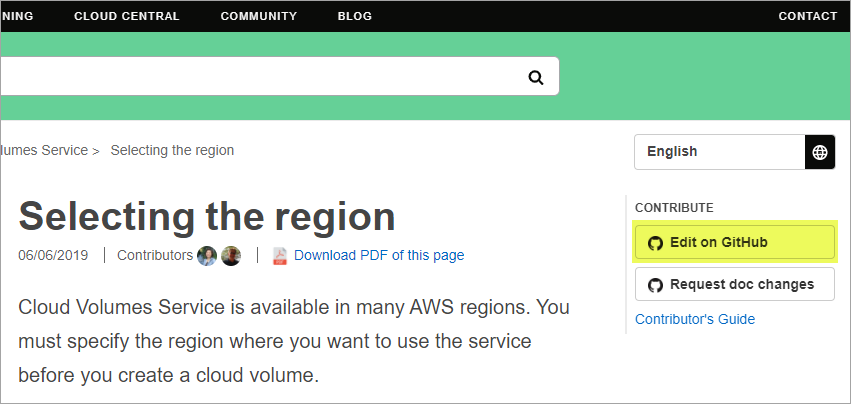
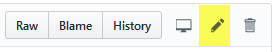
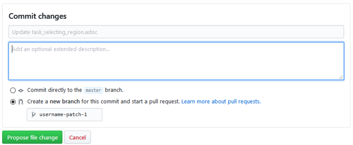
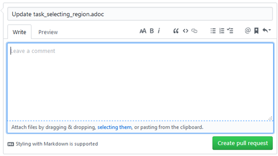
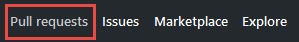
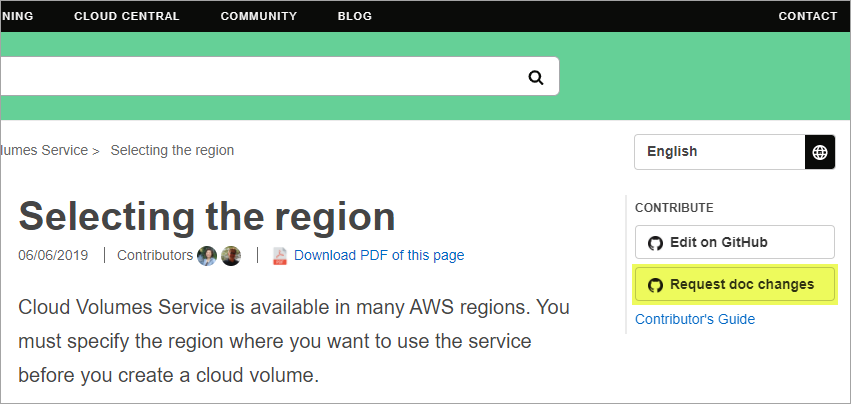
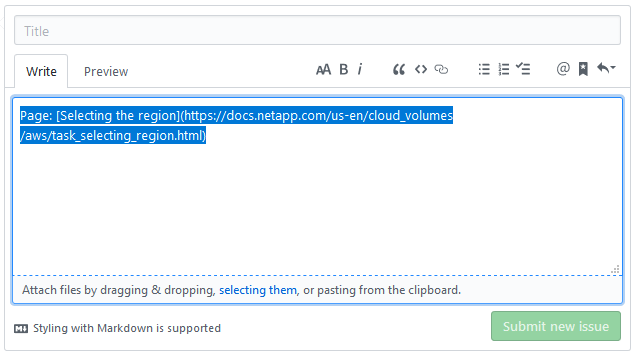

# Contributing to NetApp technical content through GitHub
User documentation for several NetApp products is hosted from GitHub.  Anyone who has a GitHub account can contribute to the published content through GitHub.

Steps
1. If you do not already have a GitHub account, [create one](https://github.com/join) through github.com.
2. Log in to your GitHub account.
3. Using a browser, open the topic that you want to contribute.

    You can edit the topic directly or request changes for the topic.
4. To edit a topic:
    1. Click *Edit on GitHub* next to the topic title.  

      

    2. Click the pencil icon and start editing the content.  

      The content is written in AsciiDoc, a Markdown language.  

      [AsciiDoc cheat sheet](http://web.netapp.com/%7Ebcammett/AsciiDoc/cheat_sheet.html)  

      

    3. To commit changes, scroll down the page, select *Create a new branch for this commit and start a pull request*, then click *Propose file change*.  

      GitHub automatically fills in a branch name (for example, _username-patch-n_) for the change.  

      

    4. Provide a comment about the edit that you made, then click *Create pull request*.

        

      After you propose the changes, NetApp Information Engineering will review your changes and merge them as appropriate to the GitHub repository to update the documentation.

      You can also view the status of the pull request by clicking *Pull requests* on the top banner next to the GitHub search box:

        

5. To request changes for a topic:
    1. Click *Request doc changes* next to the topic title.

      

      A text box appears, enabling you to provide request details.

    2. Provide details in the text box, and then click *Submit new issue* to create an issue for your request.

      The text box is prepopulated with the title and URL for the topic.  Do not delete this information.

      

      Opening an issue enables collaboration through GitHub comments. You receive email notifications based on the preferences you indicated in your GitHub account settings.

      You can also view the status of the request by clicking *Issues* on the top banner next to the GitHub search box:

      
